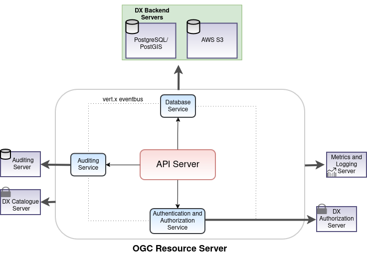

[%2520pipeline%2F)](https://jenkins.iudx.io/job/ogc%20resource-server%20(master)%20pipeline/lastBuild)
[%2520pipeline%2F)](https://jenkins.iudx.io/job/ogc%20resource-server%20(master)%20pipeline/50/testReport/)
[%2520pipeline%2FlastBuild%2Fjacoco%2F)](https://jenkins.iudx.io/job/ogc%20resource-server%20(master)%20pipeline/lastBuild/jacoco/)
[](https://jenkins.iudx.io/job/ogc%20resource-server%20(master)%20pipeline/lastBuild/Integration_20Test_20Report/)
[](https://jenkins.iudx.io/job/ogc%20resource-server%20(master)%20pipeline/lastBuild/zap/)

# OGC Resource Server
OGC (and STAC) compliant IUDX based resource server serving Geospatial data.

<p align="center">

</p>

### Prerequisites
- Make a config file based on the template in [example-config/config-example.json](./example-config/config-example.json)
- Set up the database using Flyway
- Set up AWS S3 for serving tiles and STAC assets

#### Flyway Database setup

Flyway is used to manage the database schema and handle migrations. The migration files are located at [src/main/resources/db/migrations](src/main/resources/db/migrations). The following pre-requisites are needed before running `flyway`:
1. An admin user - a database user who has create schema/table privileges for the database. It can be the super user.
2. A normal user - this is the database user that will be configured to make queries from the server 
(e.g. `CREATE USER ogc WITH PASSWORD 'randompassword';`)

[flyway.conf](flyway.conf) must be updated with the required data. 
* `flyway.url` - the database connection URL
* `flyway.user` - the username of the admin user
* `flyway.password` - the password of the admin user
* `flyway.schemas` - the name of the schema under which the tables are created
* `flyway.placeholders.ogcUser` - the username of the server user

Please refer [here](https://flywaydb.org/documentation/configuration/parameters/) for more information about Flyway config parameters.

After this, the `info` command can be run to test the config. Then, the `migrate` command can be run to set up the database. At the `/ogc-resource-server` directory, run

```
mvn flyway:info -Dflyway.configFiles=flyway.conf
mvn flyway:migrate -Dflyway.configFiles=flyway.conf
```

The database details should then be added to the server config.

#### AWS S3 setup

AWS S3 is used to serve map tiles as well as STAC asset files. An S3 bucket can be set up by following the S3 documentation, after which the S3 bucket name, region name, access key and secret key can be added to the config.

<!--- ### Docker based execution
1. Install docker and docker-compose
2. Clone this repo
3. Build the images 
   ` ./docker/build.sh`
4. Modify the `docker-compose.yml` file to map the config file you just created
5. Start the server in production (prod) or development (dev) mode using docker-compose 
   ` docker-compose up prod `
6. The server will be up on port **8080**. To change the port, add `httpPort:<desired_port_number>` to the config in the `ApiServerVerticle` module. See [example-config/config-example.json](./example-config/config-example.json) for an example. --->

### Maven based execution
1. Install Java 11 and maven
2. Set Environment variables
```
export LOG_LEVEL=INFO
```
3. Use the maven exec plugin based starter to start the server 
   `mvn clean compile exec:java@ogc-resource-server`
4. The server will be up on port **8080**. To change the port, add `httpPort:<desired_port_number>` to the config in the `ApiServerVerticle` module. See [configs/config-example.json](configs/config-example.json) for an example.

### JAR based execution
1. Install Java 11 and maven
2. Set Environment variables
```
export LOG_LEVEL=INFO
```
3. Use maven to package the application as a JAR
   `mvn clean package -Dmaven.test.skip=true`
4. 2 JAR files would be generated in the `target/` directory
    - `ogc-resource-server-dev-0.0.1-SNAPSHOT-fat.jar` - non-clustered vert.x and does not contain micrometer metrics


## License
[View License](./LICENSE)

