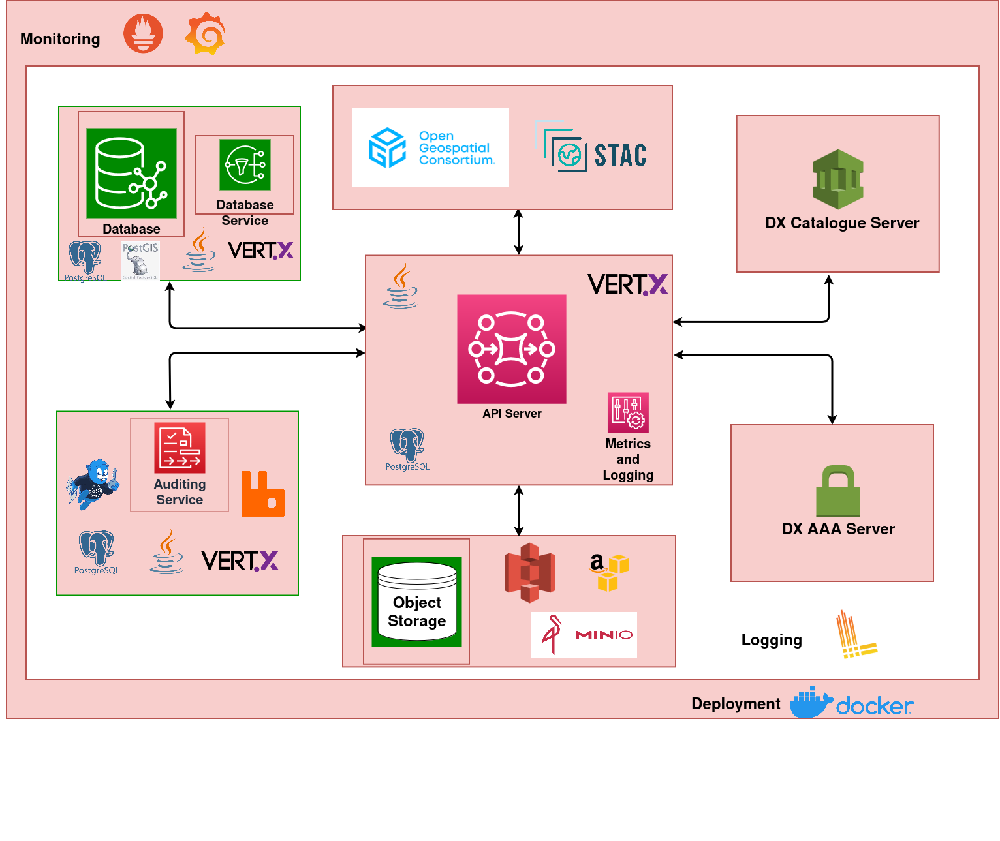

## Solution Architecture

This section provides an overview of the OGC Resource Server and its components, detailing how different services and systems interact to enable efficient geospatial data handling, authentication, and auditing. The architecture is built using Vert.x, a reactive toolkit for building applications on the Java Virtual Machine (JVM), and is designed for scalability, fault tolerance, and monitoring.

The following block diagram shows different components/services used in implementing the OGC Resource Server.

The above setup allows specific high load containers/services to scale with ease. Various components of the server are detailed in the sections below.

### API Server
The API Server is the core component of the architecture, responsible for handling all requests related to geospatial data. It exposes endpoints that comply with the Open Geospatial Consortium (OGC) standards. The API Server also handles interactions with other subsystems, such as databases, auditing, authentication service, and the catalog service.
- Technology: Vert.x, Java 
- Responsibilities:
  - Expose API endpoints for geospatial data operations
  - Communicate with storage and database services to retrieve and store data
  - Interact with the authentication service for secure access
  - Interact with the catalog service to index and retrieve resources metadata and datasets
  - Log system metrics and performance

### Open Geospatial Consortium (OGC) and SpatioTemporal Asset Catalog (STAC)
The solution adheres to Open Geospatial Consortium (OGC) standards and implements SpatioTemporal Asset Catalog (STAC) specifications, ensuring interoperability with external geospatial systems and services.
- Responsibilities:
  - Ensure that geospatial data complies with open standards (OGC, STAC)
  - Enable easy integration with external systems and data sources
  
### Database Service
The Database Service uses PostgreSQL with PostGIS extension, where all geospatial data and metadata are stored. PostGIS provides spatial capabilities to PostgreSQL, enabling advanced geospatial queries.
- Technology: PostgreSQL, PostGIS, Vert.x
- Responsibilities:
  - Manage and retrieve geospatial data 
  - Perform advanced geospatial queries and operations 
  - Store metadata following the OGC and STAC standards.

### DX AAA Server
The DX Authentication, Authorization, and Accounting (AAA) Server is responsible for managing user authentication, enforcing role-based access control (RBAC), and handling authorization for API requests.
- Technology: Custom Authentication Service, Vert.x 
- Responsibilities:
  - Authenticate users using standard mechanisms 
  - Issue and validate bearer tokens for secure API interactions
  - Ensure secure and authorized access to API Server resources

### DX Catalogue Server
The DX Catalogue Server is responsible for managing the indexing and retrieval of resource metadata and datasets. It enables efficient search, discovery, and retrieval of various types of resources in the system, ensuring that all metadata and datasets are properly indexed for fast access.
- Technology: Vert.x, Java 
- Responsibilities:
  - Index and retrieve metadata and datasets for efficient search and discovery
  - Ensure resources are discoverable and accessible via API interactions

### Auditing Service
The Auditing Service is responsible for tracking user activity, recording API access, and ensuring compliance with data usage policies. The service utilizes RabbitMQ for queuing and processes audit logs asynchronously.
- Technology: RabbitMQ, PostgreSQL, Vert.x
- Responsibilities:
  - Track user actions on the API server
  - Ensure compliance with auditing and monitoring requirements
  - Process audit logs for both real-time and historical analysis

### Object Storage
The object storage component manages the storage of large spatial datasets such as raster images, tiles, and vector data. It integrates with external object storage services such as AWS S3(cloud-based storage service) or MinIO(on-premise object storage) for efficient data handling
- Technology: MinIO, AWS S3
- Responsibilities:
  - Store raw geospatial data, such as imagery, vector tiles, and stac assets
  - Provide highly available and scalable object storage 
  - Interface with the API server to deliver data to clients

### Monitoring and Logging
Metrics and Logging are crucial for monitoring system performance and health. This subsystem includes a robust monitoring and logging framework. While Log4j and Vert.x Micrometer are used within the server code for logging and metrics collection, Prometheus, Grafana, and Loki are employed during deployment to provide observability, visualization, and analysis.
- Monitoring (In-code):
  Vert.x Micrometer is used to instrument the application for gathering key metrics such as request counts, response times, and system performance data.
- Logging (In-code):
 Log4j is used for logging within the server code, enabling structured log entries for different levels like debug, info, and error.
- Deployment Monitoring and Logging:
  - Prometheus collects the application metrics exposed by Vert.x Micrometer in real-time. 
  - Grafana visualizes these metrics, allowing for the creation of dashboards to monitor system performance. 
  - Loki stores the logs, enabling efficient log management and querying for system events and issues.